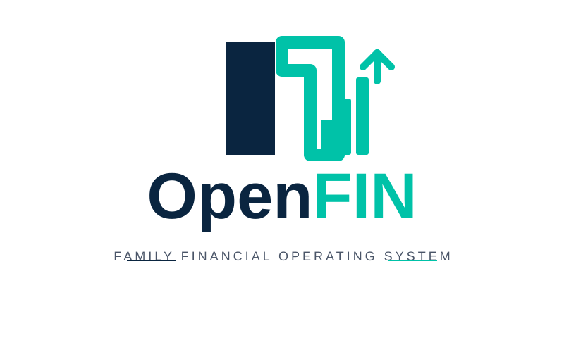

<p align="center">
  
</p>

**A household financial early-warning system.** It does not tell you what your
budget was. It tells you what is about to happen to your money, when, how much,
and what you could do about it.

**[Open the app](https://jchristadore-ux.github.io/OpenFIN/)**

---

## The daily loop

```
Update the balance in the app  ->  forecast runs  ->  risk engine runs  ->  daily summary email
```

That is the household's only manual step, and it happens **in the app** — type
today's balance, tap Update. There is no separate "balance received" email and
nothing is emailed to submit a balance. Updating the balance *is* what sends the
daily summary and outlook.

**No balance update means no daily summary.** A financial email anchored to a
stale balance reads as authoritative and is quietly wrong, which is worse than
silence.

### How the app writes without a server, and without a token

GitHub Pages is static, so recording a balance needs a credential — but it does
not need to be on your phone. A small **Cloudflare Worker** (`worker/`) holds
the GitHub token as a server-side secret and is the only thing that ever sees
it. The app POSTs to the Worker, the Worker fires the engine.

Access is **Cloudflare Access** with email one-time-PIN, free for up to 50
users. Each phone signs in once by email code. Nothing is stored on the device,
and both phones see the same model because it lives in the repo.

Setup is in **[worker/README.md](worker/README.md)** — one token, one deploy,
one Access policy. The **Daily balance** workflow in the Actions tab remains a
manual fallback.

### Deferring, to stay afloat

**Defer to stay afloat** lists every bill due this week and in the lookahead
window with a tick box. Ticking recalculates *safe to spend* **instantly in the
browser** — the arithmetic is a transcription of `forecast.safe_discretionary`
and is pinned by parity tests, so what you see while experimenting is what the
engine will produce when you save. Save hands it to the engine, which rebuilds
the forecast and re-runs the risk sweep.

A deferred occurrence is **marked, never deleted**. It stays on the calendar,
the running total of what has been pushed is shown next to the figure, and the
wording says plainly that deferring moves money rather than removing it. Bills
that are secured or not normally deferrable are shaded and labelled, but not
blocked — the engine refuses to *recommend* deferring a mortgage; it does not
refuse to *model* it, because that is the household's call to make.

Deferrals expire on their own. Each one applies to a single occurrence, and any
dated before today is dropped on read, so a deferral never silently suppresses
next month's bill.

### Editing bills

Routine changes — an amount, the day it lands — are edited in the app under
**Edit bills** and saved permanently for both phones. Every edit is re-validated
server-side by `src/apply_edits.py`: unknown ids, negative or implausible
amounts and out-of-range days are refused, a change beyond 40% is applied but
flagged for review, and edits are all-or-nothing so a rejected one never leaves
a half-written file. Nothing is ever deleted; deactivating keeps the entry and
its history.

Structural changes — a new bill, a payoff, a changed frequency — are worth
checking against the statements first, because the statements are the source of
truth for what actually happens and when.

## The half that does not wait for you

Risk alerts are independent of the balance. `watch.yml` runs twice a day,
projects from the last known position, and emails **only** when it finds
something. A mortgage about to bounce next Tuesday is true whether or not
anyone opened the app this morning.

Alerts deduplicate. An unchanged risk is not re-sent; it goes out again only
when it worsens by more than $100, moves by more than two days, resolves and
returns, or hits the reminder threshold.

## What it watches for

| Risk | Meaning |
|---|---|
| Secured payment | A mortgage or car payment the balance cannot cover that day |
| Negative balance | The projection crosses zero |
| Large payment | A big obligation lands with too little behind it |
| Insufficient cash | Stays positive but drops under the safe floor |
| Income timing | The month works; the order does not |
| Future crunch | Fine now, a combination bites later |
| Discretionary | Nothing free to spend this week |

## Safe discretionary

Deliberately **not** `income - bills`. That answers "did we earn more than we
owe", which is not the question anyone is actually asking.

```
  balance now
+ income before end of week
- bills before end of week
- obligations in the 14 days after that
- required cash buffer
= safe to spend
```

The lookahead is what makes it honest — spending everything not owed *this*
week is exactly how a mortgage two days into next week goes unpaid. **The
number can be negative, and it is shown negative.**

## Architecture

One authoritative engine. Business logic never lives in the dashboard.

| Module | Responsibility |
|---|---|
| `src/bills.py` | Occurrence maths — when each obligation falls |
| `src/fincal.py` | The financial calendar: obligations become dated events |
| `src/forecast.py` | Balance projection and safe discretionary |
| `src/risk.py` | Risk detection and alert deduplication |
| `src/recommend.py` | Deferral options — recommends, never acts |
| `src/notify.py` | Email composition, daily and alert |
| `src/messaging.py` | SMTP delivery |
| `src/engine.py` | The orchestrator and the only entry point |
| `src/parse_upload.py` | Reads a bill screenshot into `bills.json` |
| `src/apply_edits.py` | Validates and applies bill edits made in the app |
| `worker/index.js` | `/balance`, `/bills`, `/defer` — validates, then dispatches |
| `index.html` | Renders `snapshot.json`. Computes nothing. |

Data lives in JSON committed to the repo: `bills.json`, `income.json`,
`config.json`, `state.json`, and the generated `snapshot.json`. No database, no
server, no runtime.

## Rules that matter

**Money is never a float.** Every amount is a `Decimal` rounded half-up. A
projection is a long chain of additions and `0.1 + 0.2` is not `0.3`.

**Variable bills forecast at the top of their range**, and seasonal ones carry
a month-of-year profile. Under-forecasting an outflow is what produces a
surprise overdraft. Gas runs $54 in August and $551 in March; electric inverts,
peaking at $449 in August. A single figure for either is wrong eleven months a
year, in whichever direction happens to hurt.

**Never invent a number.** If the engine cannot compute something it says so
and exits non-zero. It never presents a guess as a forecast.

**Nothing is ever deferred automatically.** The recommendation engine proposes;
the household decides. Secured obligations are never proposed.

**Never delete a bill.** A bill missing from an upload is deactivated with a
note. OCR misses a line far more often than a household cancels a mortgage.

## Running it

```bash
python -m unittest discover -s tests -v      # 87 tests, no network
python src/engine.py daily --balance 4382.17 --dry-run
python src/engine.py watch --dry-run
python src/engine.py defer --items '[{"bill_id":"netflix","date":"2026-08-23"}]'
```

## Configuration

`config.json` — safe balance floor, risk thresholds, forecast horizon,
discretionary allowance and lookahead, alert reminder cadence, balance
staleness limit. Every threshold is configurable; none are hard-coded in the
UI.

## Secrets

`SMTP_USER`, `SMTP_APP_PASSWORD`, `EMAIL_RECIPIENTS`, and optionally
`EMAIL_FROM`. Email is the only channel the system needs. The legacy SMS path
remains in `messaging.py` but nothing depends on it.

---

<sub>Repository renamed to **OpenFIN** on 11 Aug 2026. GitHub redirects the old
`TogetherLedger` URLs, so old links keep working.</sub>
